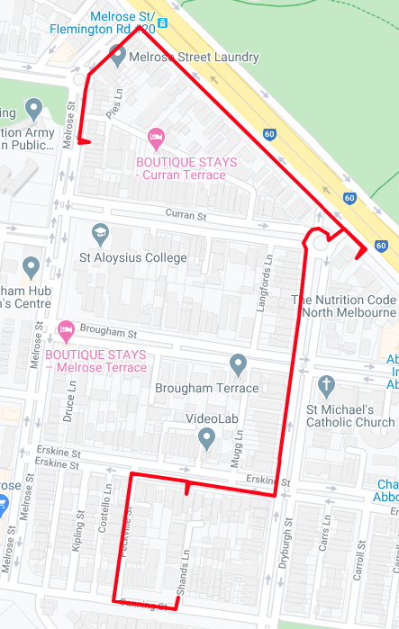

# COVID Crackdown

<!-- vim-markdown-toc GFM -->

* [A little birdie told me... (5 points/39 solves)](#a-little-birdie-told-me-5-points39-solves)
* [Call-out (20 points/36 solves)](#call-out-20-points36-solves)
* [Locked-in (20 points/15 solves)](#locked-in-20-points15-solves)
* [Chain reaction (10 points/14 solves)](#chain-reaction-10-points14-solves)
* [Contactless (20 points/8 solves)](#contactless-20-points8-solves)
* [5G (10 points/8 solves)](#5g-10-points8-solves)
* [Package Delivery (20 points/16 solves)](#package-delivery-20-points16-solves)
* [Whoooo are you? (20 points/5 solves)](#whoooo-are-you-20-points5-solves)
* [Down the rabbit hole (20 points/12 solves)](#down-the-rabbit-hole-20-points12-solves)
* [Admin panel (30 points/7 solves)](#admin-panel-30-points7-solves)
* [Carrier I (20 points/10 solves)](#carrier-i-20-points10-solves)
* [Carrier II (40 points/4 solves)](#carrier-ii-40-points4-solves)
* [COVERT-19 (10 points/16 solves)](#covert-19-10-points16-solves)
* [What's his face (30 points/5 solves)](#whats-his-face-30-points5-solves)
* [Karen I (10 points/23 solves)](#karen-i-10-points23-solves)
* [Karen II (30 points/2 solves)](#karen-ii-30-points2-solves)
* [Taking out the trash (20 points/13 solves)](#taking-out-the-trash-20-points13-solves)
* [Throwback (30 points/12 solves)](#throwback-30-points12-solves)
* [Sanny check (40 points/4 solves)](#sanny-check-40-points4-solves)

<!-- vim-markdown-toc -->

## A little birdie told me... (5 points/39 solves)

The about page on http://misc.team has the faces and names of three of the MISC employees. Benjamin Renault is the CEO. Searching "Benjamin Renault" in Twitter and filtering for people only shows his profile (amongst other, unrelated profiles). Answer: `@BenRenault9`

## Call-out (20 points/36 solves)

Benjamin tweets his Flickr profile which he has posted some pictures to. Taking a look at the pictures reveal the camera (phone model) that he used. Answer: `Oppo R1 R829T`

## Locked-in (20 points/15 solves)

On the 24th of July, Benjamin posted a tweet saying that he is in day 20 of lockdown. A quick Google search for "4th july lockdown victoria dhhs" (https://www.dhhs.vic.gov.au/coronavirus-update-victoria-4-july-2020) reveals that the postcodes 3031 (Flemington, Kensington) and 3051 (North Melbourne) went into stage 3 lockdown on the 4th July. The next piece of information that pinpoints his location is his reply to the AFL tweet which suggests he supports his local team. Only one of the three suburbs have a local football team. Answer: `north melbourne`

## Chain reaction (10 points/14 solves)

Karen's Twitter can be found by searching "Karen Jennings" in Twitter or by looking at Benjamin's followers. It seems that Karen likes Coles a lot! She also posts about a new Coles Local opening during lockdown and in another tweet, says that she lives close to her local Coles. Searching for "new coles local melbourne" might show the Coles Locals in Surrey Hills or St Kilda, but both of these opened in 2019. Looking at some other more recent news articles reveals that a new Coles Local opened in Hawthorn in May (which is during lockdown). Answer: `hawthorn`

## Contactless (20 points/8 solves)

We are looking for the web developer's phone number. There is a comment 
```html
<!-- TODO: remove personal phone numbers for privacy reasons -->
```
in the HTML of the about page, but the phone numbers aren't to be found anywhere on the page. This comment hints that the phone numbers may have been there before, in a previous version of the page but have been removed. Searching in GitHub for "Michael Reid" shows his profile on the first page. He has a repository named "website" which has 4 commits. Checking the commit history, we see that a commit was made on July 19th titled "remove personal phone numbers". Checking the diff on that commit reveals his phone number. Answer: `0424510638`

## 5G (10 points/8 solves)

The website isn't the only repository on Michael's GitHub. He has a dotfiles repository which he has (accidently) committed and pushed his `.bash_history` to! It looks like he's connected to the office wifi using a command and has included the password in cleartext in it:
```
nmcli device wifi connect MISCOffice-5G password cookiesandcream
```
Answer: `cookiesandcream`

## Package Delivery (20 points/16 solves)

A packet capture file is given. This can be opened in Wireshark and looking through it will show us a conversation between `10.0.0.22` and `10.0.0.32` over FTP. It seems that a file is being uploaded and since the file is not encrypted, we can easily extract it from the pcap and read its contents.
With Wireshark:
1. Filter by "ftp-data"
2. Follow the TCP stream
3. Save data as raw

The file is a spreadsheet document that contains the total amount made. Answer: `1140`

## Whoooo are you? (20 points/5 solves)

The system administrator is responsible for the servers, so their contact details would likely be in the whois data for the domain `misc.team`. We released a hint which also points in this direction. Checking whois on https://www.name.com/whois-lookup/ for `misc.team` will give something like this:

```
Domain Name: misc.team
Registry Domain ID: a3d51a060a7f4a37945b9afced7ab478-DONUTS
Registrar WHOIS Server: whois.name.com
Registrar URL: http://www.name.com
Updated Date: 2020-07-15T11:29:48Z
Creation Date: 2020-07-10T11:29:04Z
Registry Expiry Date: 2021-07-10T11:29:04Z
Registrar: Name.com, Inc.
Registrar IANA ID: 625
Registrar Abuse Contact Email: abuse@name.com
Registrar Abuse Contact Phone: +1.7203101849
Domain Status: clientTransferProhibited
https://icann.org/epp#clientTransferProhibited
Registry Registrant ID: REDACTED FOR PRIVACY
Registrant Name: REDACTED FOR PRIVACY
Registrant Organization: MISC
Registrant Street: REDACTED FOR PRIVACY
Registrant City: REDACTED FOR PRIVACY
Registrant State/Province: VIC
Registrant Postal Code: REDACTED FOR PRIVACY
Registrant Country: AU
Registrant Phone: REDACTED FOR PRIVACY
Registrant Phone Ext: REDACTED FOR PRIVACY
Registrant Fax: REDACTED FOR PRIVACY
Registrant Fax Ext: REDACTED FOR PRIVACY
Registrant Email: Please query the RDDS service of the Registrar of Record identified in this output for information on how to contact the Registrant, Admin, or Tech contact of the queried domain name.

Details pertaining to the registrant and admin are all redacted for privacy, however it is shown that the registrar of the domain is name.com. Going to whois.name.com and searching for misc.team brings up this information on the registrant:

Domain Name: MISC.TEAM
Registry Domain ID: a3d51a060a7f4a37945b9afced7ab478-DONUTS
Registrar WHOIS Server: whois.name.com
Registrar URL: http://www.name.com
Updated Date: 2020-07-15T11:29:48Z
Creation Date: 2020-07-10T11:29:04Z
Registrar Registration Expiration Date: 2021-07-10T11:29:04Z
Registrar: Name.com, Inc.
Registrar IANA ID: 625
Reseller:
Domain Status: clientTransferProhibited https://www.icann.org/epp#clientTransferProhibited
Registry Registrant ID: Not Available From Registry
Registrant Name: Ana Kohoutová
Registrant Organization: MISC
Registrant Street: Union House, University of Melbourne
Registrant City: Parkville
Registrant State/Province: VIC
Registrant Postal Code: 3010
Registrant Country: AU
Registrant Phone: +61.415185558
Registrant Email: @gmail.com
Registry Admin ID: Not Available From Registry 
```

This gives an email and a name, which can be searched on twitter to obtain the handle. Answer: `@ana_kohoutova`

## Down the rabbit hole (20 points/12 solves)

The task asks for the IP address of the mail server. We notice on the about page that the employee's emails are `@misc.team` so we start by looking at the MX records for the domain `misc.team`. Using `dig` (there exists online interfaces for it), we get `mail.misc.team` as an answer for the MX record. Running `dig` again on `mail.misc.team` reveals the IP. Answer: `14.137.223.165`

## Admin panel (30 points/7 solves)

On Michael's GitHub repository for the website, there is a curious `admin.html` file. Navigating to http://misc.team/admin.html reveals an admin panel page which asks for a password. The password is authenticated client side using Javascript. The code that checks if the password is correct:

```javascript
// use one time pad for perfect secrecy
function enc(v) {
    var l = eval(atob('WzYyLCAxMzAsIDE5MSwgMTMwLCAxMjEsIDE0MSwgMjEsIDQzLCAyNTAsIDE4OCwgNTUsIDk3LCA3MCwgOCwgMTI5LCAxNzIsIDE0MCwgMjMzLCA5NywgMTMzLCAyMDMsIDE0OSwgNDksIDIxMCwgMjQ3LCA4NSwgMzEsIDEwNiwgMTQwLCA5NCwgMTgzLCA0OCwgMTM5LCAxNDUsIDM4LCA5NSwgNF0='))
    var o = []
    for(var i = 0; i < v.length; i++) {
        o.push(l[i] ^ v.charCodeAt(i))
    }
    return o
}

window.onload = function() {
    document.getElementById('adminform').onsubmit = function() {
        var inp = document.getElementById('password').value
        var fb = document.getElementById('fb')
        var a = eval(atob('Wzc3LCAyNDcsIDIwNywgMjMxLCAxMSwgMTYwLCAxMDIsIDc4LCAxNTMsIDIwNiwgODIsIDIxLCAxMDcsIDEyMywgMjI4LCAyMDcsIDI0OSwgMTU1LCA0LCAyMjUsIDIzMCwgMjQ0LCA4NSwgMTkxLCAxNTgsIDU5LCA1MCwgMjYsIDIzNywgNDgsIDIxMCwgOTIsIDE2NSwgMjQ5LCA4MiwgNTAsIDEwNF0='))
        var c = enc(inp)
        if(a.length != c.length) {
            fb.innerText = 'Incorrect Password'
            return false
        }
        for(var i = 0; i < a.length; i++) {
            if(a[i] != c[i]) {
                fb.innerText = 'Incorrect Password'
                return false
            }
        }
        fb.innerText = 'Success! Logging in...'
        location.href = '/admin/' + inp
        return false
    }
}
```

Solving this challenge requires a bit of knowledge about XOR. The comment at the start hints to further readings. The password is verified by checking that `p XOR l == a`  where `l` and `a` are constants in the code. Since XOR is commutative, we can recover `p` by computing `a XOR l`:

```javascript
var l = eval(atob('WzYyLCAxMzAsIDE5MSwgMTMwLCAxMjEsIDE0MSwgMjEsIDQzLCAyNTAsIDE4OCwgNTUsIDk3LCA3MCwgOCwgMTI5LCAxNzIsIDE0MCwgMjMzLCA5NywgMTMzLCAyMDMsIDE0OSwgNDksIDIxMCwgMjQ3LCA4NSwgMzEsIDEwNiwgMTQwLCA5NCwgMTgzLCA0OCwgMTM5LCAxNDUsIDM4LCA5NSwgNF0='))
var a = eval(atob('Wzc3LCAyNDcsIDIwNywgMjMxLCAxMSwgMTYwLCAxMDIsIDc4LCAxNTMsIDIwNiwgODIsIDIxLCAxMDcsIDEyMywgMjI4LCAyMDcsIDI0OSwgMTU1LCA0LCAyMjUsIDIzMCwgMjQ0LCA4NSwgMTkxLCAxNTgsIDU5LCA1MCwgMjYsIDIzNywgNDgsIDIxMCwgOTIsIDE2NSwgMjQ5LCA4MiwgNTAsIDEwNF0='))
console.log(l.map((x, i) => String.fromCharCode(x ^ a[i])).join(''))
```

which reveals the password: `super-secret-secured-admin-panel.html`.

Behind the admin panel is a table which contains customer records. The earliest one is at the bottom. Answer: `ahmed anwar`

## Carrier I (20 points/10 solves)

We are given a `route.gpx` file which is just an XML file containing coordinates. There exists many online tools that can read GPS data files and draw the route on a map for us. My Maps (https://mymaps.google.com/) is one of them. Since My Maps prefers data in KML format, we can use another tool (https://gpx2kml.com/) to convert from GPX to KML. Importing the file into My Maps reveals the route:



From the provided file, we can tell that the delivery person starts at the bottom, and so the third house they visit is the one on Melrose St. Zooming in and reading the address gives the answer. Answer: `104 melrose st`

## Carrier II (40 points/4 solves)

This task requires us to trace the journey of a V/Line train throughout the day. Trying to do this with the timetables provided by V/Line for customers is not possible as they don't provide information other than departure and arrival times. However, V/Line has a corporate website that is public and contains documents about train schedules in a lot more detail (https://corporate.vline.com.au/Network-Access/Network-service-plan). The passenger boarded the train on a weekday, so we look at the passenger schedules for weekdays. The 5:26 Traralgon train can be found on the Eastern schedule with business ID 8402. Scrolling down the page, we see that it forms the 7:46 service to Traralgon with business ID 8441. We next look for the 8441 service to see what it forms, and so on. It helps to have all of the pdfs together as one big pdf so searching is a bit easier. Tracing the train's journey, we get:

| Business ID       | Depart                | End                                | Forms          |
| ---               | ---                   | ---                                | ---            |
| 8402 (eastern)    | traralgon 05:26       | flinders street 07:30 platform 7   | 8441 07:46 TRN |
| 8441 (eastern)    | flinders street 07:46 | traralgon 10:06                    | 8416 10:19 SPE |
| 8416 (eastern)    | traralgon 10:19       | southern cross 12:37 platform 16a  | 8023 13:20 EAG |
| 8023 (northern)   | southern cross 13:20  | eaglehawk 15:32                    | 8044 15:48 SPE |
| 8044 (northern)   | eaglehawk 15:48       | southern cross 18:02 platform 7    | 8331 18:22 SER |
| 8331 (nth east)   | southern cross 18:22  | seymour 19:55 platform 2           | 8336 20:23 SPE |
| 8336 (nth east)   | seymour 20:23         | southern cross 21:46 platform 8    | 8187 22:55 WED |
| 8187 (western)    | southern cross 22:55  | wendouree 00:25                    | 8180 00:30 SPE |
| 8180 (western)    | wendouree 00:30       | southern cross 01:59 platform 1    | OFF            |

Answer: `southern cross,01:59,1`

## COVERT-19 (10 points/16 solves)

The description text hints at a Caesar shift cipher. Trying different shift amounts reveals an English message shifting by 7 characters. Answer: `ice cream cures coronavirus`

## What's his face (30 points/5 solves)

We are given a phone number and are tasked with finding the name of the person who owns that phone number. The title is a subtle hint to two popular messaging/social media platforms that can have accounts associated with a phone number (Whatsapp and Facebook). Whatsapp allows users to add contacts via phone number, and will show their status if made public (which is the default setting):


The person links to their Facebook account in their status. Navigating to https://fb.me/sanders.j88 reveals their name. Answer: `jeremy sanders`

## Karen I (10 points/23 solves)

Googling for something along the lines "karen from bunnings suburb" gives the suburb Narre Warren. Checking Narre Warren Bunnings gives their phone number. Answer: `(03) 8796 6600`

## Karen II (30 points/2 solves)

A quick google search for something along the lines of "australian karen 2" brings up her name - Lizzy Rose. Googling this brings up her website, psychicoraclelizzyrose.com. The sole blog post on her website is titled "welcome to the new website", and was published in November 2017. In the copyright information, it is written that "You may quote extracts from the website with attribution to http://www.psychicoraclelizzyrose.com & lizzyrose.com.au". Trying to access lizzyrose.com.au shows that the website is no longer active. Going to the Wayback Machine, it can be seen that there are many snapshots taken for the website lizzyrose.com.au. Accessing a snapshot in early 2017 shows that the website once had a CV page, on which all her training is listed. This shows that in 2011, she was training at Jason Coleman's ministry of dance, and her instructor was Sarah Croser. Answer: `jason coleman's ministry of dance,sarah croser`

## Taking out the trash (20 points/13 solves)

We are given a gzipped tarball containing 10000 emails and are tasked with counting the number of emails from each email address. A simple Python script can help us do this automatically:

```python
from collections import defaultdict

counts = defaultdict(int)

for i in range(10000):
    fn = 'email-file-'+str(i).zfill(5)+'.eml'
    with open('emails/'+fn, 'r') as f:
        d = f.read().splitlines()
        From = d[2].split('From: ')[1].strip()
        counts[From] += 1

email, count = max(counts.items(), key=lambda x: x[1])
print(f'{email},{count}')
```

Answer: `government1971au@alice.it,1053`

## Throwback (30 points/12 solves)

There's a tool on https://repl.it/repls/FormalYellowgreenLinux#main.py that gives the url for all instagram posts tagged with a certain location, before any point in time. Inputting the target location https://www.instagram.com/explore/locations/216247401/bourke-street-melbourne/?hl=en and date 2020/5/15 gives the URL https://www.instagram.com/explore/locations/216247401/bourke-street-melbourne/?max_id=2309947309791641600, which shows all posts made on and before the 15th of May. The first post on 05/15 was made by meeniemouse_. Answer: `meeniemouse_`

## Sanny check (40 points/4 solves)

We are given a picture that contains part of a barcode that is a bit too hard to scan, but clear enough to read (most of it anyway). We can transcribe the bar lengths and reconstruct the barcode to find the product's EAN which we can then use to search up and find the company that makes the product. Note that we are given almost all of the barcode (we can tell since the location of the separating WBWBW is roughly in the middle). The last white bar width is covered up, but since it can only be 1, 2, 3 or 4, we can easily bruteforce it by creating barcodes and seeing which ones scan. The Python program below does that:

```python
from PIL import Image

s = '1111411132111232122213131121111132113211321121213112111?111'

def makebarcode(s, fn):
    BARW = 5
    HEIGHT = 400
    WIDTH = sum(map(int, s)) * BARW
    img = Image.new('1', (WIDTH,HEIGHT))
    def drawline(x, width, col):
        for y_ in range(HEIGHT):
            for x_ in range(x, x+width):
                img.putpixel((x_, y_), col)
    x = 0
    for i, v in enumerate(s):
        v = int(v)*BARW
        drawline(x, v, i & 1)
        x += v
    img.save(fn)

for i in range(1, 5):
    makebarcode(s.replace('?', str(i)), 'barcode{}.png'.format(i))
```

Scanning them and looking the results up (e.g. here https://www.ean-search.org/) reveals that the product is "MICROSHIELD ANGEL BLUE®" made by Schulke. Their ABN is at the bottom of their website. Answer: `49605683172`
